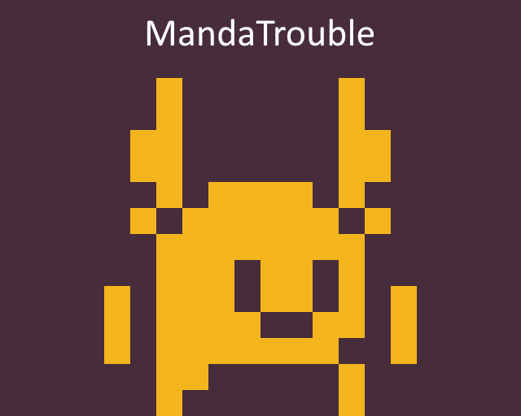

# MandaTrouble

</img>

A Ludum Dare 46 game with the theme "Keep it alive".

You’ve crashed on a mysterious planet. All that was left is you and this yellowish creature that you need to protect in order it stays alive…

## How to run

Head over to the [latest release](https://github.com/mineiwik/LD46/releases/latest) and download the file suitable for your operating system [MandaTrouble-linux.x86_64](https://github.com/mineiwik/LD46/releases/download/v1.0.0/MandaTrouble-linux.x86_64) for Linux and [MandaTrouble-windows.exe](https://github.com/mineiwik/LD46/releases/download/v1.0.0/MandaTrouble-windows.exe) for Windows (Sorry, no Mac support).
Once the download has finished you can just go ahead and execute the file and the game *should* start. 

## Developer instructions

The game runs on the [Godot](https://godotengine.org/) game engine.
You can clone the repository (or download the source code) and import it in Godot to check it out.
